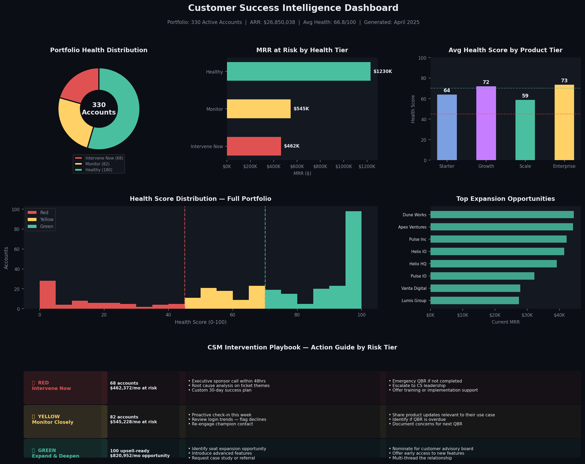
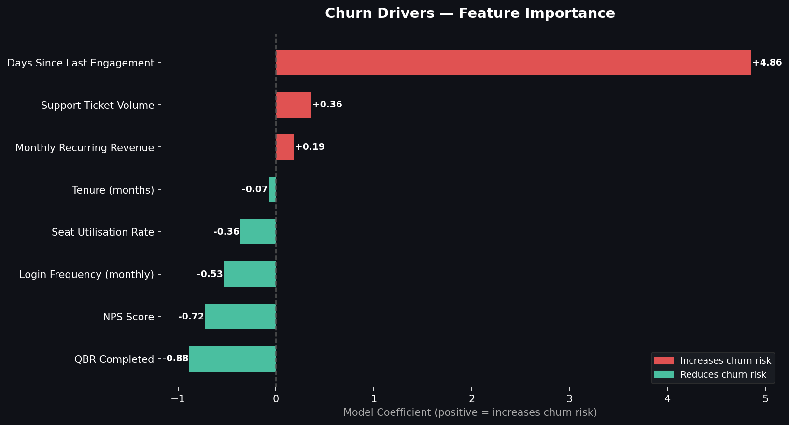
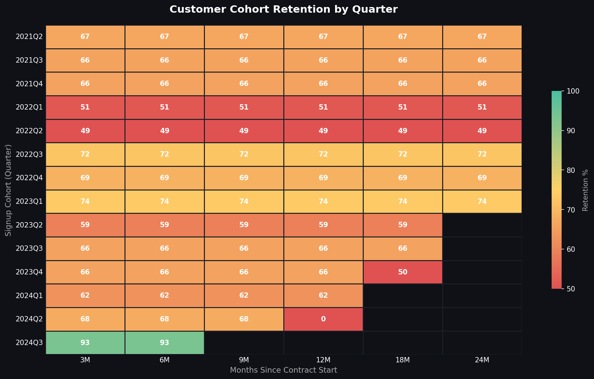
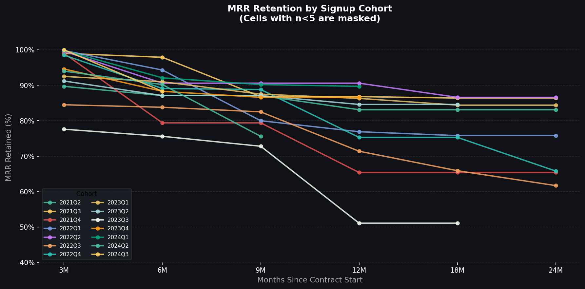
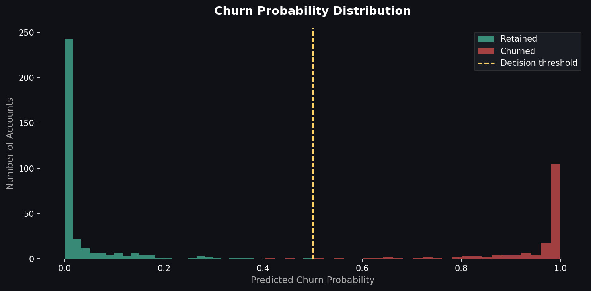

# Customer Success Intelligence Suite

## The Problem This Solves

Most CS teams are reactive. They find out a customer is about to churn during a renewal call — or worse, after they've already cancelled. By that point the relationship is already damaged and the revenue is already lost.

This project builds the infrastructure for a proactive CS motion: a system that ingests customer engagement data, identifies deteriorating accounts before they escalate, quantifies revenue at risk, and surfaces expansion opportunities that would otherwise go unnoticed.

I built this because the tools exist (Gainsight, Totango, ChurnZero) but understanding what they're actually doing under the hood — and being able to replicate that logic from scratch — is what separates a CSM who uses software from a CSM who thinks strategically about customer health.

---

## What's In Here

### 1. Customer Dataset (500 accounts, ~$30M ARR)
A synthetic but realistic SaaS customer dataset built around four archetypes observed in client-facing roles:

- **Power Users** — deeply embedded, low churn risk, expansion candidates
- **Casual Adopters** — moderate engagement, need nurturing and QBR consistency
- **At-Risk Accounts** — disengaging across multiple signals simultaneously
- **Silent Churners** — the hardest segment: low activity, high ticket volume, missed QBRs

The archetype structure matters because real CS work is not about averages — it is about recognizing which type of customer you are dealing with and adjusting your playbook accordingly.

### 2. Churn Prediction Model
Logistic regression model trained on seven engagement signals:

| Signal | Why It Matters |
|--------|---------------|
| Login frequency | Strongest leading indicator — disengagement precedes cancellation by 60-90 days |
| Support ticket volume | High volume signals product friction or implementation failure |
| NPS score | Lagging indicator, but sharp drops are a red flag |
| QBR completion | Customers who avoid QBRs are often avoiding a conversation they know will be uncomfortable |
| Seat utilisation | Paying for seats they do not use = easy justification to cancel at renewal |
| Days since last engagement | The silent killer — no news is not good news |
| Tenure | Early-tenure churn (months 3-6) and late-tenure churn (month 13+) have different root causes |

**Model performance: ROC-AUC 0.814**

A perfect score (1.0) would mean the data is too clean to be realistic. 0.814 reflects what actually happens in practice — some churners look healthy right up until they cancel, and some distressed accounts renew because switching costs are high. The model is most accurate on the extremes and appropriately uncertain in the middle, which is where CSM judgment matters most.

### 3. CS Health Score Dashboard
Each account receives a weighted health score (0-100):

| Signal | Weight |
|--------|--------|
| Login frequency | 30% |
| Support ticket volume | 25% |
| NPS score | 20% |
| Seat utilisation | 15% |
| QBR completion | 10% |

| Tier | Score | Action |
|------|-------|--------|
| Red | Below 45 | Executive sponsor call within 48hrs, emergency success plan |
| Yellow | 45-69 | Proactive check-in, QBR review, champion re-engagement |
| Green | 70+ | Expansion conversation, case study request, referral ask |

### 4. Cohort Retention Analysis
Tracks what percentage of each quarterly signup cohort remains active at 3, 6, 9, 12, and 24 months.

---

## Key Findings

**1. Login frequency is the single strongest churn predictor.**
Accounts logging in fewer than 6 times per month show dramatically higher churn probability. In practice this means weekly login reports should be the first thing a CSM reviews on Monday morning — not their inbox.

**2. QBR completion correlates strongly with retention.**
Customers who skip QBRs churn at significantly higher rates. This is not because the QBR itself saves the account — it is because willingness to engage is itself a signal of health. A customer who will not schedule a QBR has often already mentally moved on.

**3. Silent churners are the hardest to catch and the most expensive.**
Moderate logins, elevated tickets, NPS in the 5-6 range — they look like casual adopters but churn like at-risk accounts. The intervention here is qualitative: relationship-building conversations that go beyond metrics.

**4. $878K/month in expansion MRR sits in the green tier.**
104 accounts with high health scores and high seat utilisation are actively constrained by their current contract. These are the easiest upsell conversations in the book — the product is already proving value, they just need more of it.

---

## Portfolio Snapshot (April 2025)

| Metric | Value |
|--------|-------|
| Active accounts | 323 |
| Total ARR under management | $30,106,662 |
| Avg portfolio health score | 62.3 / 100 |
| Red accounts — MRR at risk | 93 accounts / $572,757/mo |
| Yellow accounts — MRR at risk | 60 accounts / $515,739/mo |
| Green accounts | 170 accounts |
| Expansion pipeline | 104 accounts / $878,948/mo |

---

## Dashboard Preview

## How I Would Use This Day-to-Day

**Weekly:** Pull the red account list Monday morning. Any account that moved from yellow to red since last week gets same-day outreach. Not an email — a call.

**Monthly:** Refresh the cohort analysis. If a recent cohort is tracking below older cohorts at the same tenure mark, that is a signal to audit the onboarding process, not just individual accounts.

**Quarterly:** Rerun the churn model on fresh data. Feature importance shifts over time — what predicted churn 12 months ago may not be the strongest signal today, especially after product updates or pricing changes.

**Ongoing:** The expansion list feeds directly into QBR prep. Any green-tier account with utilisation above 75% and NPS above 7.5 gets an expansion conversation built into the next touchpoint.

---

## Technical Stack

- Python (pandas, numpy, scikit-learn, matplotlib, seaborn)
- Logistic Regression with StandardScaler normalisation
- Weighted health scoring modelled on Gainsight/ChurnZero methodology
- Cohort analysis with quarterly bucketing and MRR retention tracking

---

*Built to demonstrate how analytical thinking and CS domain knowledge combine to turn engagement data into revenue protection and expansion strategy.*
